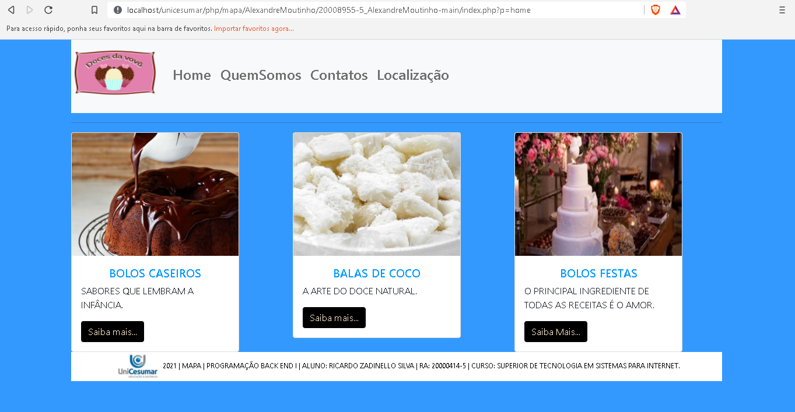
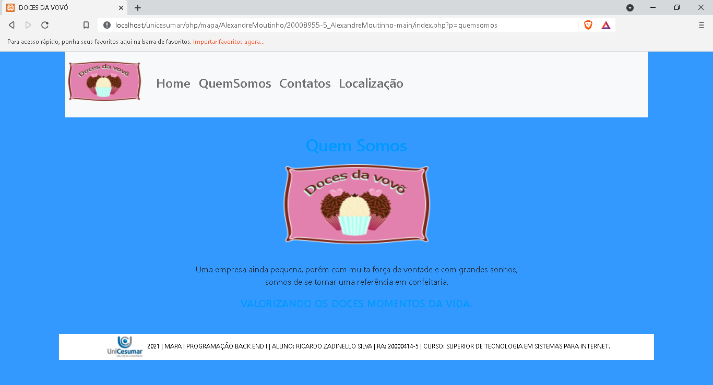
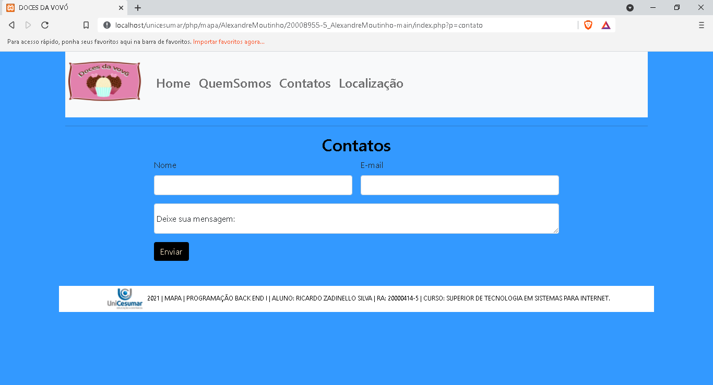
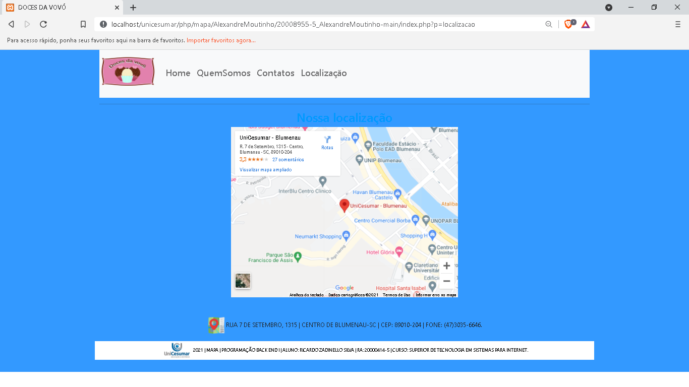
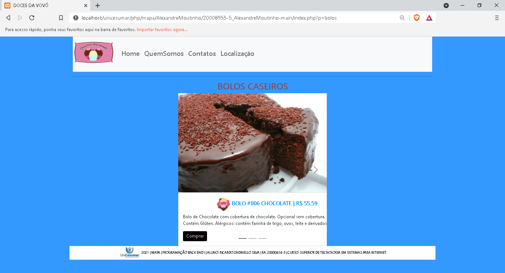

# #-----------------< Ativida de MAPA >----------------#

# 2021 | Aluno: RICARDO ZADINELLO SILVA  | RA: 20000414-5

## 📦 Tecnologias utilizadas para construção:
- HTML5 -  Como linguagem de marcação.
- CSS3  -  Para estilização de todos os componentes.
- Bootstrap 5.
- PHP
  
## Preview do projeto

git clone https://github.com/ricardozadinell/back-and-i

# back-and-i
